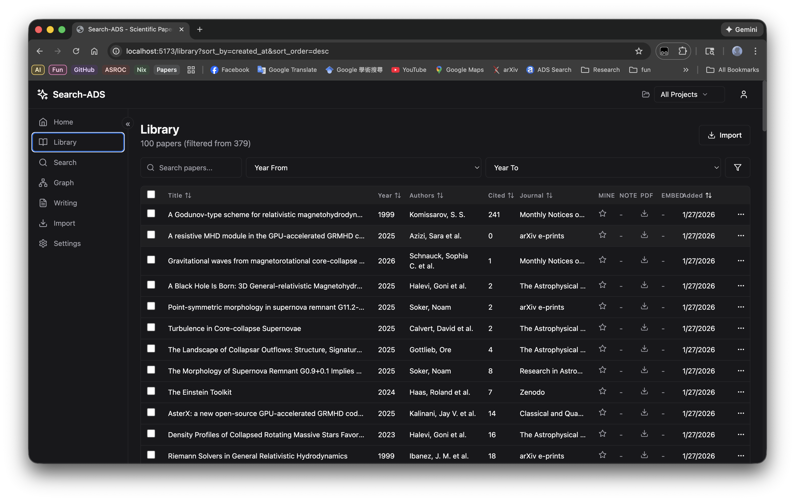
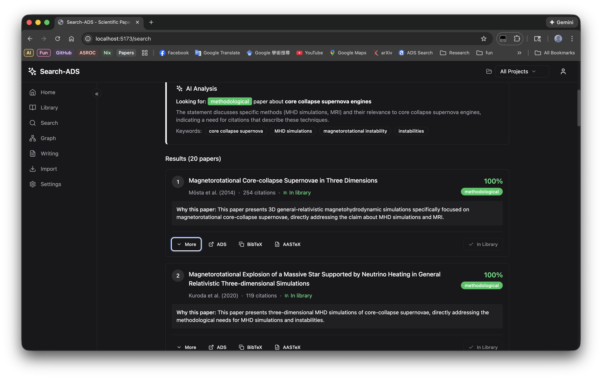
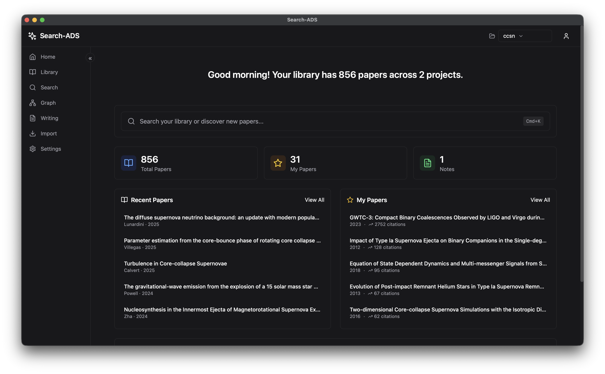
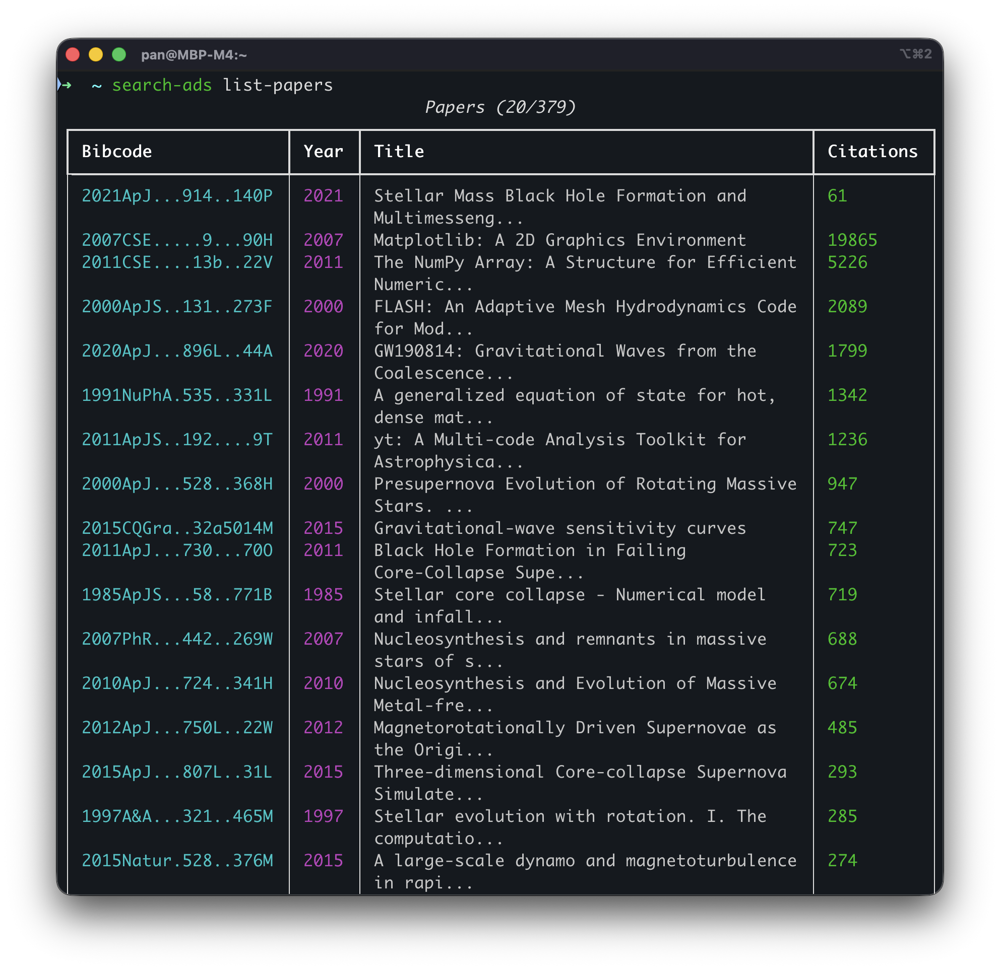
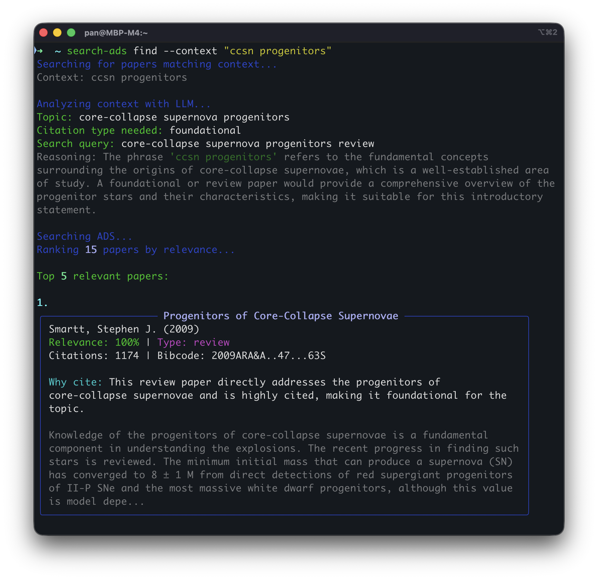

# Search-ADS


**AI-powered reference manager for astronomers and astrophysicists.**

Search-ADS helps you find, organize, and cite scientific papers using NASA ADS (Astrophysics Data System). It combines semantic search and LLM-powered analysis to make managing your research library effortless.

**Version: 0.6.0-beta**

## Screenshots

**Web UI - Library View**


**Web UI - Search**


**macOS Native App**


**CLI - Search & Results**


**CLI - Paper Details**


## Features

- **AI-Powered Search** - Find papers using natural language queries, not just keywords
- **Semantic Search** - Search your library by meaning using vector embeddings
- **PDF Management** - Download, store, and search through paper PDFs
- **LLM Ranking** - Intelligently rank papers by relevance using Claude or OpenAI
- **LaTeX Integration** - Auto-fill `\cite{}`, `\citep{}`, `\citet{}` commands
- **BibTeX & AASTeX** - Generate bibliography entries automatically
- **Project Organization** - Tag papers across multiple research projects
- **Web UI & CLI** - Use whichever interface suits your workflow
- **macOS Native App** - Standalone desktop application with Tauri
- **Cross-Platform** - Runs on macOS, Linux, and Windows (experimental)

> **Note:** The provided scripts (`install.sh`, `launch.sh`) are designed for macOS and Linux (or WSL). Windows users may need to execute the commands from these scripts manually or use WSL.


## Requirements

**For CLI only:**
- Python 3.10+
- pipx (recommended) or pip
- NASA ADS API key (free)

**For full installation (CLI + Web UI):**
- All of the above, plus:
- Node.js 18+ and npm
- git

**Optional (for AI features):**
- OpenAI API key (for embeddings and search)
- Anthropic API key (for LLM analysis)

## Quick Start

### One-Line Installation (Recommended)

If you want both the CLI and Web UI:

```bash
# Requires: git, pipx, npm
curl -fsSL https://raw.githubusercontent.com/kuochuanpan/search-ads/main/install.sh | bash
```

This will:
- Clone the repository to `~/search-ads`
- Install the CLI tool via pipx
- Install frontend dependencies
- Initialize configuration

After installation, configure your API keys and launch:

```bash
# Edit API keys
nano ~/.search-ads/.env

# Launch the application
cd ~/search-ads && ./launch.sh
```

### CLI-Only Installation

If you only need the command-line tool:

```bash
# Using pipx (recommended)
pipx install git+https://github.com/kuochuanpan/search-ads.git

# Or using pip
pip install git+https://github.com/kuochuanpan/search-ads.git
```

Then initialize:

```bash
search-ads init
```

### Configuration

Add your API keys to `~/.search-ads/.env`:

```env
# Required
ADS_API_KEY=your_ads_api_key

# Recommended (for AI features)
OPENAI_API_KEY=your_openai_api_key

# Optional (preferred for LLM analysis)
ANTHROPIC_API_KEY=your_anthropic_api_key

# Optional (for "My Papers" feature)
MY_AUTHOR_NAMES="Smith, J.; Smith, John"

# Optional (customize LLM models)
OPENAI_MODEL="gpt-4o-mini"
ANTHROPIC_MODEL="claude-3-haiku-20240307"
```

**Get your API keys:**
- ADS: [ui.adsabs.harvard.edu/user/settings/token](https://ui.adsabs.harvard.edu/user/settings/token)
- OpenAI: [platform.openai.com/api-keys](https://platform.openai.com/api-keys)
- Anthropic: [console.anthropic.com](https://console.anthropic.com/)

### Upgrading

**Full installation:**
```bash
cd ~/search-ads
./install.sh  # Select 'n' when asked to overwrite to update
```

**CLI only:**
```bash
pipx upgrade search-ads
```

## Usage

### Add Papers to Your Library

```bash
# Add a paper by ADS URL or bibcode
search-ads seed "https://ui.adsabs.harvard.edu/abs/2021Natur.589...29B"
search-ads seed 2021Natur.589...29B

# Add with references and citations
search-ads seed 2021Natur.589...29B --expand --hops 1

# Add to a project
search-ads seed 2021Natur.589...29B --project "my-paper"
```

### Search for Papers

```bash
# AI-powered search (recommended)
search-ads find --context "Core-collapse supernovae are the primary source of neutron stars"

# Search local library only (faster)
search-ads find --context "dark matter halo mass function" --local

# Basic keyword search
search-ads find --context "gravitational waves" --no-llm
```

### Get Citation Information

```bash
# Get BibTeX and citation key
search-ads get 2021Natur.589...29B

# Get specific format
search-ads get 2021Natur.589...29B --format bibtex
search-ads get 2021Natur.589...29B --format bibitem
```

### Manage Your Library

```bash
# View library status
search-ads status

# List papers
search-ads list-papers --limit 20

# Embed papers for semantic search
search-ads db embed

# Update citation counts
search-ads db update
```

### Work with PDFs

```bash
# Download a paper's PDF
search-ads pdf download 2021Natur.589...29B

# Search through PDFs
search-ads pdf search "simulation methodology" --top-k 5
```

### Organize with Projects

```bash
# Create a project
search-ads project init "agn-feedback"

# List projects
search-ads project list

# Add paper to project
search-ads project add-paper 2021Natur.589...29B --project "agn-feedback"
```

## Web UI

Search-ADS includes a modern web interface for visual library management.

### Starting the Web UI

**If installed via install.sh:**

```bash
cd ~/search-ads
./launch.sh
```

### macOS Native App

Search-ADS usually runs as a web application, but you can also build a native macOS application using Tauri.

**Download:** [Latest Release](https://github.com/kuochuanpan/search-ads/releases)

**Prerequisites:**
- Rust and Cargo (install via [rustup.rs](https://rustup.rs))
- Node.js and npm

**Build Instructions:**

```bash
# 1. Build the Python sidecar (backend)
./scripts/build-sidecar.sh

# 2. Build the macOS application
cargo tauri build
```

The application will be built to `src-tauri/target/release/bundle/macos/Search-ADS.app`.

This starts both backend and frontend. Press `Ctrl+C` to stop.

**Manual Start (for development):**

```bash
# Terminal 1 - Backend
search-ads web
# or: uvicorn src.web.main:app --reload --port 9527

# Terminal 2 - Frontend
cd frontend && npm run dev
```

Access the UI at `http://localhost:5173`

### Web UI Features

| View | Description |
|------|-------------|
| **Dashboard** | Overview with stats, recent papers, and recommendations |
| **Library** | Full paper table with sorting, filtering, and bulk actions |
| **Search** | AI-powered search across your library and ADS |
| **Writing** | Paste LaTeX text and get citation suggestions |
| **Import** | Add papers from ADS URLs, BibTeX files, or clipboard |
| **Settings** | API keys, preferences, and database management |

## Claude Code Integration

Search-ADS includes a skill for [Claude Code](https://claude.ai/claude-code) to help automate citations in your LaTeX documents.

Copy the skill to your global Claude skills directory:

```bash
cp .claude/skills/search-cite.md ~/.claude/skills/
```

Then Claude Code can help you:
- Find empty citations in LaTeX files
- Search for relevant papers based on context
- Fill citations automatically
- Manage bibliography entries

## Data Storage

All data is stored locally in `~/.search-ads/`:

```
~/.search-ads/
├── .env          # API keys and configuration
├── papers.db     # SQLite database
├── chroma/       # Vector embeddings
└── pdfs/         # Downloaded PDFs
```

## Command Reference

| Command | Description |
|---------|-------------|
| `init` | Initialize configuration |
| `seed <bibcode>` | Add paper from ADS |
| `find --context "..."` | Search for papers |
| `get <bibcode>` | Get citation info |
| `show <bibcode>` | Display paper details |
| `status` | Show database stats |
| `list-papers` | List library papers |
| `mine` | Manage your own papers |
| `import --bib-file` | Import from BibTeX |
| `db embed` | Embed for semantic search |
| `db update` | Update citation counts |
| `pdf download` | Download PDF |
| `pdf search` | Search PDF contents |
| `project init` | Create project |
| `project list` | List projects |

Run `search-ads --help` for full documentation.


## Contributing

Contributions are welcome! Please feel free to submit issues and pull requests.

## Roadmap

- [ ] **Citation Graph Exploration** - Interactive visualization of citation networks
- [ ] **Zotero Integration** - Sync with Zotero libraries
- [ ] **Browser Extension** - Rapidly add papers from findings pages
- [ ] **Cloud Sync** - Sync library across devices
- [ ] **Moltbot Integration** - AI assistant integration

## License

MIT License - see [LICENSE](LICENSE) for details.

## Acknowledgments

- [NASA ADS](https://ui.adsabs.harvard.edu/) for the paper database
- [ChromaDB](https://www.trychroma.com/) for vector storage
- [Anthropic](https://anthropic.com/) and [OpenAI](https://openai.com/) for LLM APIs
- Special thanks to **Antigravity** (Google DeepMind) for coding assistance.
- Special thanks to **Claude Code** (Anthropic) for coding assistance.
